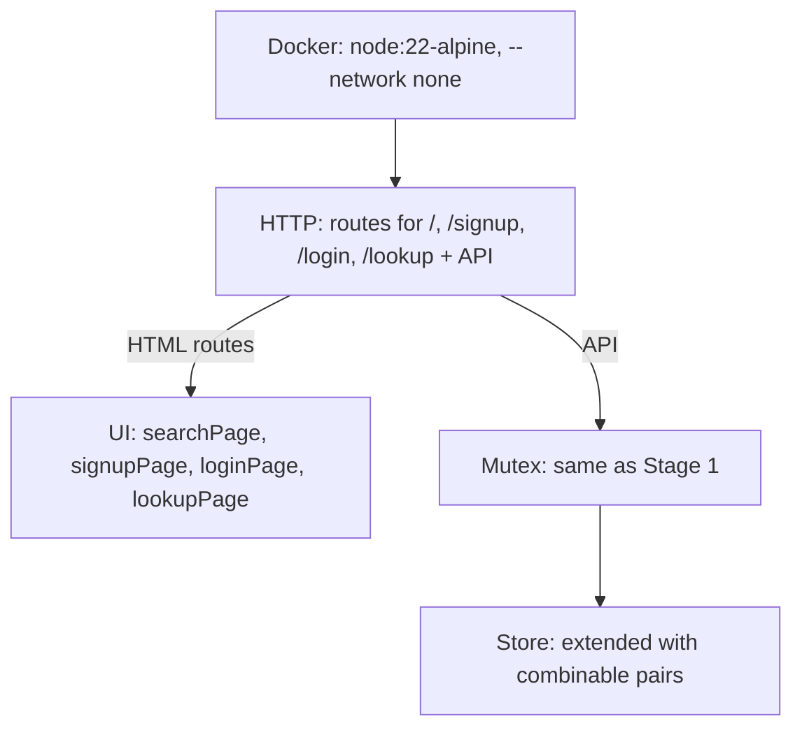

# Tablekeeper Stage 2 — Architecture Plan

**Room:** `4cc3a8dc-ca47-4980-8c89-d7e7ba293ce1`
**Output repo:** `band-work/result` → `stage-2/`
**Authority:** `stage-2/CONTRACT_LEDGER.md` (derived from `tablekeeper/spec/stage-2.md`)

## Design Summary

Extend stage-1 server with HTML page generation and serving for interactive diner UI. All existing stage-1 APIs remain unchanged.

## Architecture

### Server Extension
- Modify `app.js` to serve HTML pages from `public/` directory
- Add `ui.js` with page generation functions: `searchPage()`, `signupPage()`, `loginPage()`, `lookupPage()`
- Pages include inline CSS and JavaScript for zero-dependency offline operation

### Combined Tables Support
- `GET /availability` returns `available_options` with combinable pairs
- `POST /reservations` accepts `table_ids: ["t_1", "t_2"]` array
- Concurrency-safe table pair allocation via existing mutex

### UI State Management
- Out-of-order response handling: request counter prevents stale data overwrite
- 5-second booking timeout → `booking-uncertain` message
- Retry with same idempotency key preserves booking identity
- 409 conflict → `booking-error` with grid refresh

## Component Diagram


## Arch JSON

```arch
{
  "kind": "layered",
  "title": "Tablekeeper Stage 2 — Architecture",
  "layers": [
    {"id": "delivery", "title": "Delivery", "items": [
      {"id": "docker", "label": "Docker image: node:22-alpine, --network none, 0.0.0.0:${PORT:-8080}"}
    ]},
    {"id": "http_ui", "title": "HTTP UI", "items": [
      {"id": "routes", "label": "Routes: /, /signup, /login, /lookup"}
    ]},
    {"id": "http_api", "title": "HTTP API", "items": [
      {"id": "availability_ext", "label": "GET /availability with available_options"},
      {"id": "reservations_ext", "label": "POST /reservations table_ids extension"}
    ]},
    {"id": "ui", "title": "UI", "items": [
      {"id": "search", "label": "Search page with availability grid"},
      {"id": "auth", "label": "Signup/login forms"},
      {"id": "lookup", "label": "Reservation lookup"},
      {"id": "booking", "label": "Booking form with retry logic"}
    ]},
    {"id": "core", "title": "Core", "items": [
      {"id": "mutex_2", "label": "Concurrency: await-free critical section"},
      {"id": "store_2", "label": "State: restaurants, tables, combinable pairs"}
    ]},
    {"id": "verify", "title": "Verification", "items": [
      {"id": "harness_2", "label": "harness run --stage 2 --mode isolated"},
      {"id": "ui_tests", "label": "Node tests: UI forms, concurrency, offline"}
    ]}
  ],
  "flows": [
    {"from": "docker", "to": "http_ui", "label": "serve HTML pages"},
    {"from": "docker", "to": "http_api", "label": "serve JSON API"},
    {"from": "http_ui", "to": "ui", "label": "render pages"},
    {"from": "http_api", "to": "core", "label": "allocate & mutate"},
    {"from": "core", "to": "verify", "label": "grader drives"}
  ]
}
```

## Deliverables for @cleo-forge
- `stage-2/index.html`, `signup.html`, `login.html`, `lookup.html` in `public/`
- Updated `src/app.js` with HTML route handlers
- `src/ui.js` page generation functions
- Test suite in `stage-2/test/`
- Updated `Dockerfile` (still zero-dependency, offline)
- `RUN.md` updated for stage-2

## Stage 1 Reference
- Completed at `30916c9` with tags `accept-stage-1`, `stage-1-accepted`
- Zero-dependency in-memory reservation service
- 120/120 harness tests pass
- Adversarial probes verified (50-way concurrency, idempotency, DST)