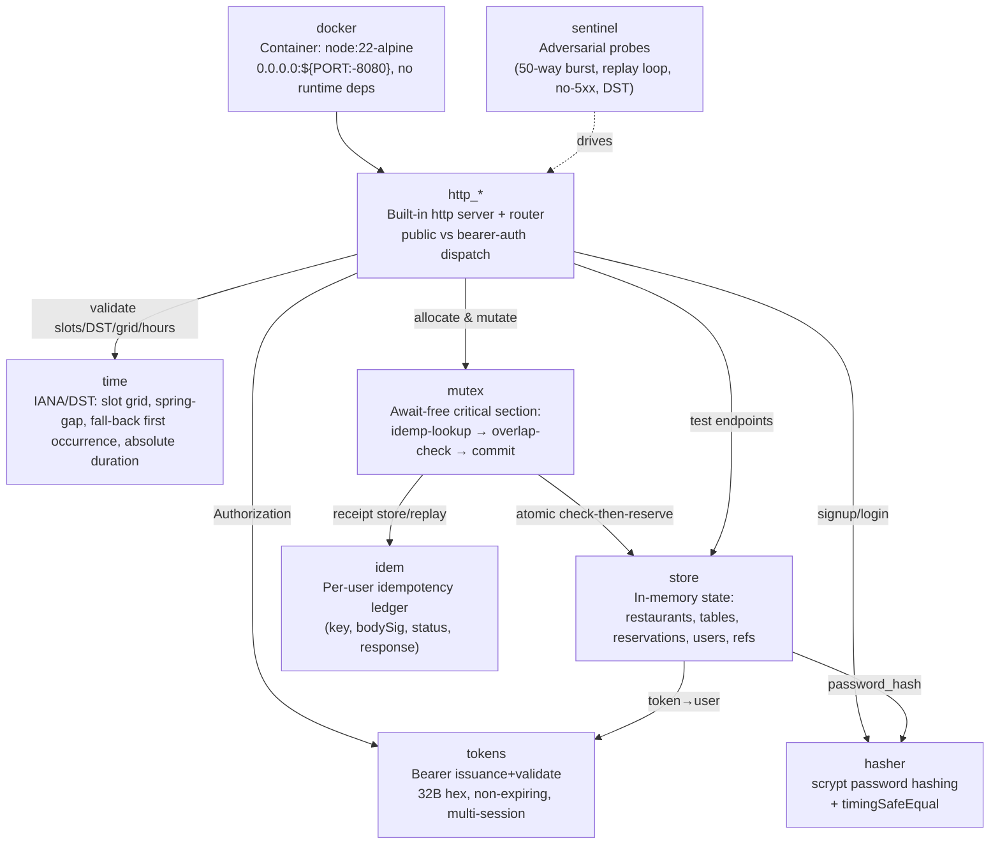

# Tablekeeper Stage 1 — Architecture (cleo-architect)

**Room:** `4cc3a8dc-ca47-4980-8c89-d7e7ba293ce1`
**Output repo:** `band-work/result` → `stage-1/`
**Authority:** `tablekeeper/spec/stage-1.md` + `tablekeeper/test/stage_1/*` (oracle: `CONTRACT_LEDGER.md`)
**Design date:** derived before implementation is declared final (per Stage 0 plan: *Architect derives CONTRACT_LEDGER before code*).

## Design summary
A single-container, **zero runtime-dependency** Node.js HTTP service (built-in `http` + `crypto`).
State is in-memory and is the **only** mutable surface; it is swapped atomically by the test
control endpoints. The concurrency safety core is the **single-threaded event loop + an
await-free allocation critical section** (L7): the idempotency lookup, the overlap check and
the reservation/idempotency commit happen with no `await` between them, so under the 50-way
`burst` barrier exactly one booking can ever win and 49 get `409 table_unavailable`, with
zero 5xx.

**Backend note (architect decision):** the time model can be realised two equivalent ways
seen in the working tree — (a) Temporal (needs `node:22-alpine` + `NODE_OPTIONS=--harmony-temporal`)
or (b) `Intl.DateTimeFormat` (no flag, but requires **full ICU tz data** in the Alpine image).
Either satisfies §9; `docker` must ship the tzdata that the chosen approach reads. @cleo-forge
picks the build. The oracle in L3/L8 is implementation-agnostic.

## Component diagram


## Arch JSON (room diagram source, ```arch fence)
```arch
{
  "kind": "layered",
  "title": "Tablekeeper Stage 1 — Architecture (cleo-architect)",
  "layers": [
    {"id": "delivery", "title": "Delivery", "items": [
      {"id": "docker", "label": "Docker image (node:22-alpine): no runtime deps, 0.0.0.0:${PORT:-8080}"}
    ]},
    {"id": "http_*", "title": "HTTP", "items": [
      {"id": "http_*", "label": "Built-in http server + router; public vs bearer-auth dispatch; await-free handlers"}
    ]},
    {"id": "auth", "title": "Auth & Security", "items": [
      {"id": "tokens", "label": "Bearer token gen/validate (32B hex, non-expiring, multi-session)"},
      {"id": "hasher", "label": "scrypt password hashing + timingSafeEqual"}
    ]},
    {"id": "time", "title": "Time", "items": [
      {"id": "time", "label": "IANA/DST resolver: slot grid, spring-gap rejection, fall-back first occurrence, absolute duration"}
    ]},
    {"id": "core", "title": "Core", "items": [
      {"id": "mutex", "label": "Await-free critical section: idempotency-lookup -> overlap-check -> commit"},
      {"id": "idem", "label": "Per-user idempotency ledger (key, bodySig, status, response)"},
      {"id": "store", "label": "In-memory state: restaurants/tables, reservations, users, used references"}
    ]},
    {"id": "verify", "title": "Verification", "items": [
      {"id": "harness", "label": "harness run --track tablekeeper --repo <repo> --stage 1 --mode host|isolated"},
      {"id": "node_tests", "label": "node --test test/ (stage-1/test)"},
      {"id": "sentinel", "label": "cleo-sentinel: 50-way burst, idempotency replay, no-5xx, DST probes"}
    ]}
  ],
  "flows": [
    {"from": "docker", "to": "http_*", "label": "serve HTTP"},
    {"from": "http_*", "to": "auth", "label": "bearer/parse"},
    {"from": "http_*", "to": "time", "label": "validate DST/slots"},
    {"from": "http_*", "to": "core", "label": "allocate & mutate"},
    {"from": "core", "to": "verify", "label": "grader drives"}
  ]
}
```

## Mapping: ledger → components
- **L1 (networking/process)**: `docker`
- **L2 (conventions)**: `store` (ID generation, opaque IDs)
- **L4 (auth)**: `tokens`, `hasher`
- **L8 (time/DST)**: `time`
- **L5 (idempotency)**: `idem`
- **L6/L9 (endpoints + state lifecycle)**: `store`, `http_*`
- **L7 (concurrency)**: `mutex` (the await-free critical section inside `http_*` over `store`+`idem`)

## Verification contract for @cleo-forge
Implement so that `harnes check --track tablekeeper .` reports **0 problems** and
`harness run --track tablekeeper --repo . --stage 1 --mode host|isolated` passes every
`test/stage_1/*`, including the 50-way `burst` (exactly one 201 + 49×409, zero 5xx), the
idempotency replay loop, and the Berlin/NY DST transitions. Deliverables due from forge:
`stage-1/Dockerfile`, `stage-1/RUN.md`, `stage-1/test/**`, and the reconciled single
implementation (delete the other of the two parallel trees currently in `src/`).
