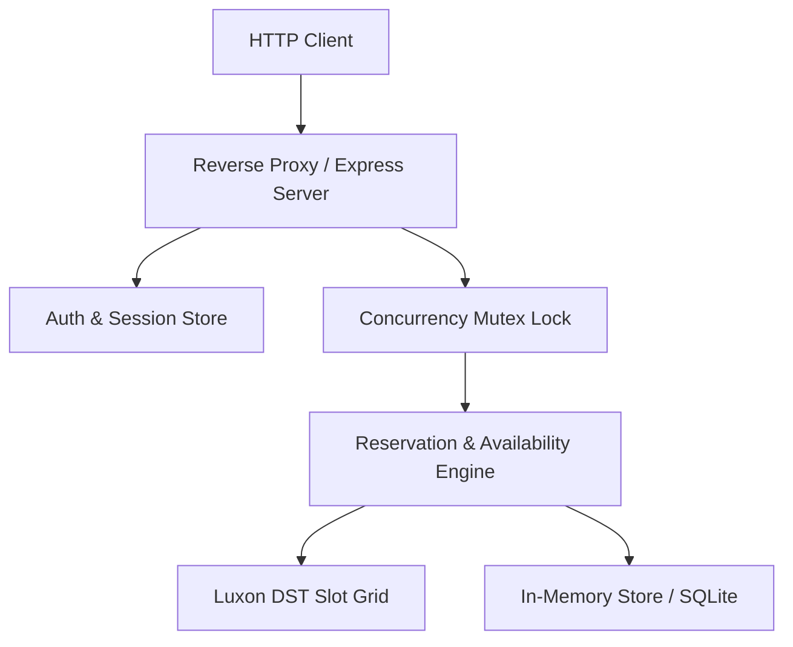

# Dark Factory Architecture Plan

## Factory Stages
- [x] Stage 1: Specification Ledger & Concurrency Engine
- [ ] Stage 2: Browser UI & Client Workflow
- [ ] Stage 3: Dynamic Policies & Effective Dating
- [ ] Stage 4: Closure Replanning & Batch Moves
